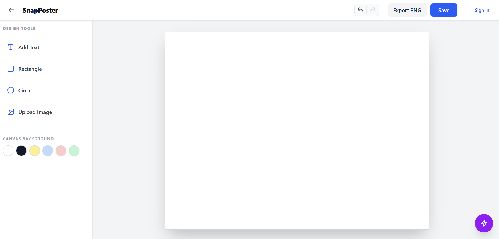
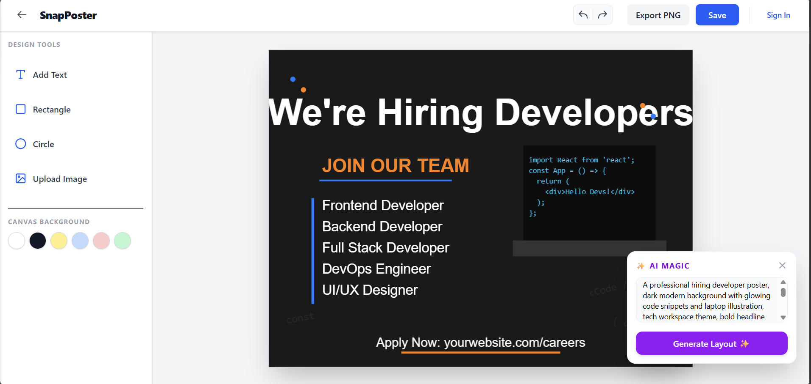
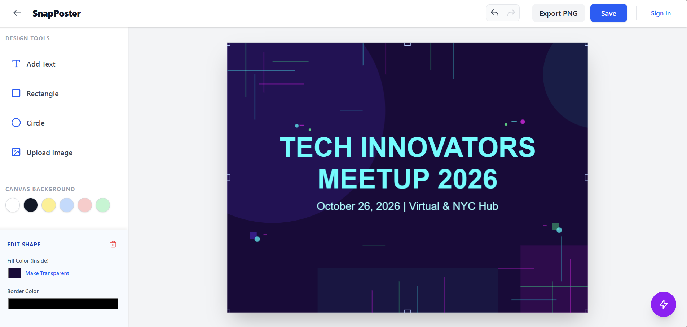

# 🎨 SnapPoster: AI-Powered Canvas Studio

  

A professional, full-stack application for generating, editing, and managing high-quality posters. SnapPoster combines a robust HTML5 Canvas editor with AI-powered layout generation to take your designs from concept to completion in seconds.

---

## 📸 Example Poster Screenshots

### The Canvas Workspace


### AI-Generated Layouts
<div align="center">
  
  
</div>
*Posters generated entirely via Gemini AI prompts and rendered instantly on the HTML5 Canvas.*

---

## 🚀 Key Features

* **🖌️ Advanced Canvas Editor:** Powered by Fabric.js v6. Features drag-and-drop, resize handles, and a dynamic property inspector for shapes and typography.
* **✨ AI Magic Layouts:** Integrated with Google's Gemini AI. Type a prompt, and the AI generates a completely editable, formatted canvas layout.
* **☁️ Secure Cloud Storage:** Direct integration with Cloudinary for seamless image uploading and hosting.
* **🔒 Private Workspaces:** JWT-based authentication ensures every designer has a secure, isolated dashboard to manage their projects.
* **📥 High-Fidelity Export:** One-click rendering to download posters as high-resolution PNGs.
* **↩️ Bulletproof History:** Granular Undo/Redo functionality capturing micro-changes on the canvas.

---

## 🛠️ Tech Stack

* **Frontend:** React.js, Vite, Tailwind CSS, Zustand, Fabric.js (v6)
* **Backend:** Node.js, Express.js
* **Database:** MongoDB Atlas, Mongoose
* **Auth & Security:** JWT (JSON Web Tokens), BCrypt
* **External APIs:** Google Gemini API (AI generation), Cloudinary (Image Hosting)

---

## ⚙️ Installation & Setup

1.  **Clone the repository**
    ```bash
    git clone [https://github.com/Abhilashalahare/SnapPoster.git](https://github.com/Abhilashalahare/SnapPoster.git)
    cd SnapPoster
    ```

2.  **Backend Setup**
    Navigate to the backend folder and install the required dependencies:
    ```bash
    cd backend
    npm install
    ```
    Create a `.env` file in the root of the `backend` directory:
    ```env
    PORT=5000
    MONGO_URI=your_mongodb_connection_string
    JWT_SECRET=your_super_secret_jwt_key
    CLOUDINARY_CLOUD_NAME=your_cloud_name
    CLOUDINARY_API_KEY=your_api_key
    CLOUDINARY_API_SECRET=your_api_secret
    GEMINI_API_KEY=your_gemini_api_key
    ```
    Start the backend development server:
    ```bash
    npm run dev
    ```

3.  **Frontend Setup**
    Open a new terminal window, navigate to the frontend folder, and install dependencies:
    ```bash
    cd ../frontend
    npm install
    ```
    Create a `.env` file in the `frontend` folder:
    ```env
    VITE_API_URL=http://localhost:5000/api
    ```
    Start the frontend development server:
    ```bash
    npm run dev
    ```

---

## 🧠 Architecture Explanation

This application utilizes a modern MERN-stack architecture split into two distinct environments:

1. **Frontend (React + Vite):** Uses **Zustand** for lightweight global state management (handling the Fabric.js canvas instance and User Auth). The canvas engine runs on **Fabric.js (v6)**, utilizing modern Promise-based methods (`await canvas.loadFromJSON`) to render objects, text, and images dynamically based on user interaction or AI payload.
2. **Backend (Node.js + Express):** A RESTful API connected to **MongoDB**. Relational mapping ties `Design` documents strictly to `User` documents. Passwords are mathematically hashed using `bcryptjs`, and API routes are protected via custom middleware that verifies JSON Web Tokens.
3. **AI Pipeline:** The backend securely communicates with the **Gemini API**, parsing natural language prompts into structured JSON coordinate data (specifying width, height, colors, and positioning) that the frontend Fabric.js engine instantly translates into visual canvas objects.

---

## 🔌 API References

*All protected routes require a JWT token in the `Authorization` header: `Bearer <your_token>`.*

**Authentication**
* `POST /api/auth/register` - Create a new user account.
* `POST /api/auth/login` - Authenticate a user and receive a JWT.

**Designs (Protected)**
* `GET /api/designs` - Fetch all saved posters for the logged-in user.
* `POST /api/designs` - Save a new poster to the database.
* `GET /api/designs/:id` - Load a specific poster into the workspace.
* `PUT /api/designs/:id` - Update an existing poster's JSON canvas data.
* `DELETE /api/designs/:id` - Permanently delete a poster.

**Utilities**
* `POST /api/upload` - Upload a local image file to Cloudinary. Returns the secure URL.
* `POST /api/ai/generate` - Send a text prompt to Gemini AI. Returns Fabric.js compatible JSON objects.

---

## ⚠️ Known Limitations

* **Mobile Editing:** While the dashboard is responsive, the Fabric.js canvas editor is currently optimized for desktop/tablet use. Touch-dragging on mobile devices may behave unpredictably.
* **AI Object Overlap:** Because the AI generates coordinate math dynamically, complex prompts may occasionally result in overlapping text boxes. Users can easily correct this using the drag-and-drop UI.
* **Custom Font Uploads:** Currently, the platform relies on a set list of web-safe fonts. Custom `.ttf` font file uploading is planned for a future release.

---

## 📬 Contact

**Abhilasha Lahare**
* [GitHub Profile](https://github.com/Abhilashalahare)
* [LinkedIn](https://www.linkedin.com/in/abhhilashha/)
